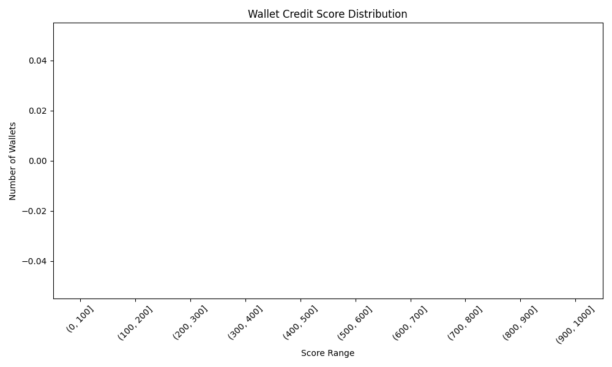

# Credit Score Analysis

## Score Distribution

```json
{
  "(0, 100]": 0,
  "(100, 200]": 0,
  "(200, 300]": 0,
  "(300, 400]": 0,
  "(400, 500]": 0,
  "(500, 600]": 0,
  "(600, 700]": 0,
  "(700, 800]": 0,
  "(800, 900]": 0,
  "(900, 1000]": 0
}
```

## Score Statistics

```json
{
  "mean": NaN,
  "median": NaN,
  "std": NaN,
  "min": NaN,
  "max": NaN
}
```

## Top Wallets (High Scores)

```json
[]
```

## Bottom Wallets (Low Scores)

```json
[]
```



